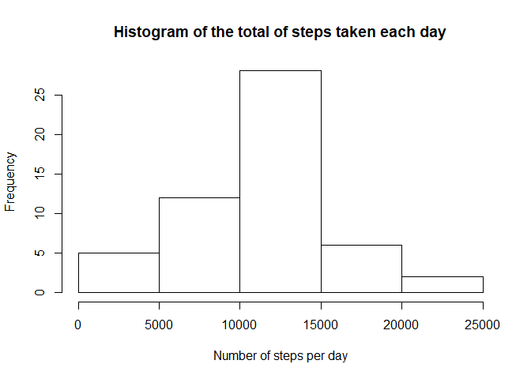
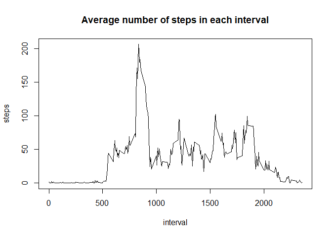

## Loading and processing the data

```r
unzip("activity.zip")
data <- read.csv("activity.csv")
# Convert date variable from type factor to type date
data$date <- as.Date(data$date, formate = "%Y%m%d")
head(data)
```

```
##   steps       date interval
## 1    NA 2012-10-01        0
## 2    NA 2012-10-01        5
## 3    NA 2012-10-01       10
## 4    NA 2012-10-01       15
## 5    NA 2012-10-01       20
## 6    NA 2012-10-01       25
```

## What is mean total number of steps taken per day?
Histogram of the total number of steps taken each day

```r
library(plyr)
```

```
## Warning: package 'plyr' was built under R version 3.6.3
```

```r
stepssum <- (ddply(data, .(date), colwise(sum)))[, 1:2]
hist(stepssum$steps, xlab = "Number of steps per day", main = "Histogram of the total of steps taken each day")
```

<!-- -->

The mean total number of steps taken per day is :

```r
mean(stepssum$steps, na.rm = TRUE)
```

```
## [1] 10766.19
```
The median total number of steps taken per day is :

```r
median(stepssum$steps, na.rm = TRUE)
```

```
## [1] 10765
```

## What is the average daily activity pattern?
Time series plot of the 5-minute interval and the average number of steps taken, averaged across all days

```r
steps.interval <- aggregate(x = data, by = list(interval = data$interval), mean, na.rm = TRUE)[, 1:2]
# Time-series plot
with(steps.interval, plot(interval, steps, type = "l", main = "Average number of steps in each interval"))
```

<!-- -->

The 5-minute interval that contains the maximum number of steps is :

```r
steps.interval[which(steps.interval$steps == max(steps.interval$steps)), 1]
```

```
## [1] 835
```

## Imputing missing values
Number of missing values in the dataset :

```r
sum(is.na(data$steps))
```

```
## [1] 2304
```
My strategy for imputing missing values is substituting missing values with the mean of the 5-minute interval of the values. The new dataset would look like this :

```r
newdata <- data
for (i in 1:nrow(newdata)) {
  if (is.na(newdata[i, 1]) == TRUE) 
    newdata[i, 1] = steps.interval[which(steps.interval$interval == newdata[i, 3]), 2]
}
head(newdata)
```

```
##       steps       date interval
## 1 1.7169811 2012-10-01        0
## 2 0.3396226 2012-10-01        5
## 3 0.1320755 2012-10-01       10
## 4 0.1509434 2012-10-01       15
## 5 0.0754717 2012-10-01       20
## 6 2.0943396 2012-10-01       25
```
Histogram of the total number of steps taken each day :

```r
new.stepssum <- ddply(newdata, .(date), colwise(sum))[, 1:2]
hist(new.stepssum$steps, xlab = "Number of steps per day", main = "Histogram of the total of steps taken each day")
```

<!-- -->

The new mean total number of steps taken per day is :

```r
mean(new.stepssum$steps)
```

```
## [1] 10766.19
```
The new median total number of steps taken per day is :

```r
median(new.stepssum$steps)
```

```
## [1] 10766.19
```
While the new mean does not change, the new median only changes slightly.  

## Are there differences in activity patterns between weekdays and weekends?

```r
newdata$weekday <- !(weekdays(newdata$date) %in% c("Saturday", "Sunday"))
newdata$weekday <- as.factor(newdata$weekday)
newdata$weekday <- revalue(newdata$weekday, c("TRUE" = "weekday", "FALSE" = "weekend"))
steps.interval2 <- aggregate(x = newdata$steps, by = list(weekday = newdata$weekday, interval = data$interval), mean)
colnames(steps.interval2)[3] <- "steps"
library(lattice)
```

```
## Warning: package 'lattice' was built under R version 3.6.3
```

```r
with(steps.interval2, xyplot(steps~interval|weekday, type = "l", main = "Average number of steps during a weekend and a weekday", ylab = "Number of steps", xlab = "Interval", layout = c(1, 2)))
```

<!-- -->
